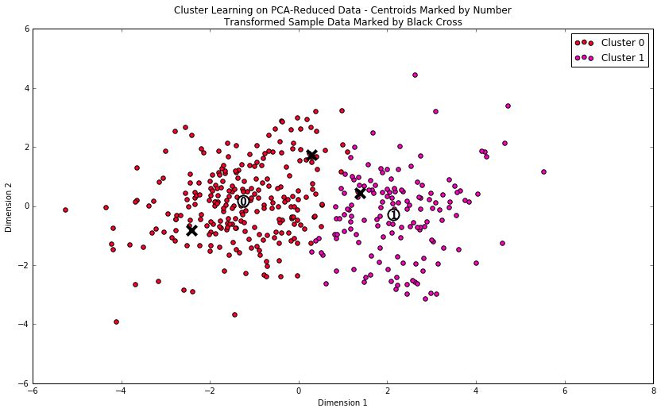

# Creating Customer Segments

#### Using clustering (unsupervised learning) to analyze customer purchase habbits

In this project, a **Gaussian Mixture Model** is fit with customer data to create customer segments. Principle Component Analysis (PCA) is used to reduce the dimensionality of the dataset and make meaningful interpretation of product segments.


### Install

This project requires **Python 2.7** and the following Python libraries installed:

- [NumPy](http://www.numpy.org/)
- [Pandas](http://pandas.pydata.org)
- [matplotlib](http://matplotlib.org/)
- [scikit-learn](http://scikit-learn.org/stable/)

You will also need to have software installed to run and execute an [iPython Notebook](http://ipython.org/notebook.html)

[Anaconda](https://www.continuum.io/downloads), a pre-packaged Python distribution that contains all of the necessary libraries and software for this project, is recommended. 

### Code

Code is provided in the notebook `customer_segments.ipynb` notebook file. Additional supporting code can be found in `renders.py`. 


### Run

In a terminal or command window, navigate to the top-level project directory `creating_customer_segments/` (that contains this README) and run one of the following commands:

```ipython notebook customer_segments.ipynb```
```jupyter notebook customer_segments.ipynb```

This will open the iPython Notebook software and project file in your browser.

## Data

The dataset used in this project is included as `customers.csv`. You can find more information on this dataset on the [UCI Machine Learning Repository](https://archive.ics.uci.edu/ml/datasets/Wholesale+customers) page.

# Results

The presence of two clusters was the most significant result (seen in the figure below).
